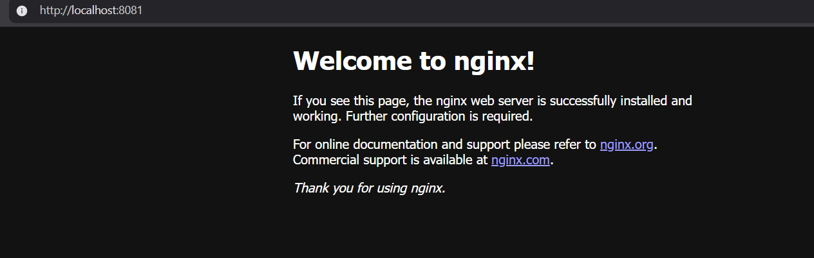

# Terraform IaC with Docker

## 📌 Objective
Provision a local Docker container using **Terraform** as part of Task 3: *Infrastructure as Code (IaC)*.

---

## 🛠 Tools Used
- Terraform
- Docker

---

## 📂 Repository Structure
- `main.tf` → Terraform configuration file to create Nginx container  
- `execution_logs.txt` → Logs of terraform init, plan, apply, state list, and destroy  
- `terraform.lock.hcl` → Provider lock file  
- `.gitignore` → Ignoring Terraform state files  

---

## 🚀 Steps to Run

1. **Clone the repo**
   ```bash
   git clone https://github.com/Vysh-reddy-boddu/terraform-iac.git
   cd terraform-iac
2. Initialize Terraform

   terraform init


3. Check the plan

   terraform plan


4. Apply the configuration

   terraform apply -auto-approve


5. Verify Container

   docker ps


Open browser → http://localhost:8081 → You should see Welcome to Nginx!

6. Check Terraform state

   terraform state list


7. Destroy the infrastructure

   terraform destroy -auto-approve
8. Screenshot

   

